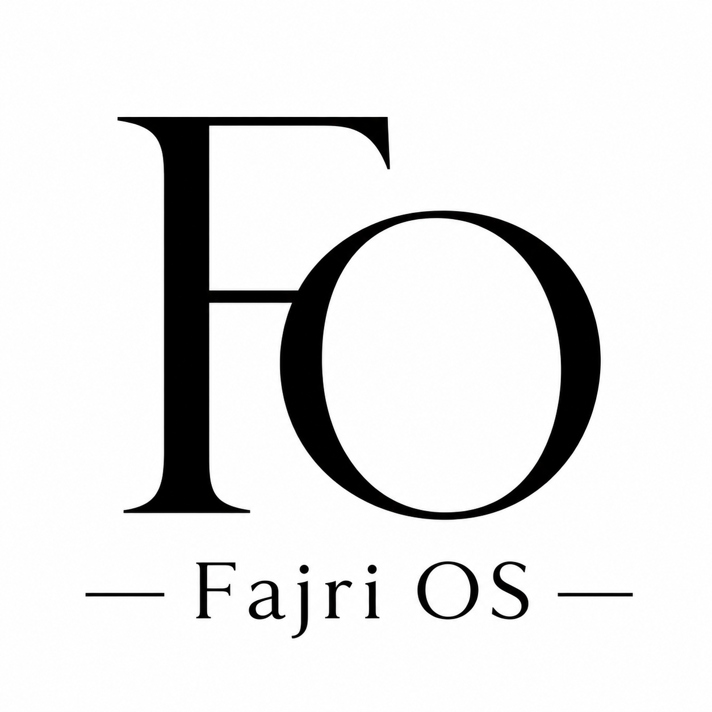

<div align="center">

  

  # ⚡ FAJRI-OS — PORTFOLIO WEBSITE
  ### *Next-Gen Dual-Mode Portfolio: Cyberpunk Terminal CLI & Modern Neubrutalist GUI*

  <p align="center">
    <strong>Muhammad Fajri Setyawan</strong> (@LazenFajri)<br />
    <em>Teknik Informatika S1 @ Universitas Dian Nuswantoro (UDINUS) • Creative Coder & Motion Designer</em>
  </p>

  <!-- Status & Badges Bar -->
  <p align="center">
    <a href="https://astro.build"></a>
    <a href="https://tailwindcss.com"></a>
    <a href="https://p5js.org"></a>
    <a href="https://www.typescriptlang.org"></a>
    <a href="https://github.com/LazenFajri"></a>
  </p>

  <!-- Quick Navbar -->
  <p align="center">
    <a href="#-overview"><b>🌟 Overview</b></a> •
    <a href="#-dual-mode-experience"><b>🎭 Dual-Mode UI</b></a> •
    <a href="#-core-features"><b>✨ Features</b></a> •
    <a href="#-terminal-cli-commands"><b>💻 Interactive CLI</b></a> •
    <a href="#-tech-stack--tools"><b>🛠️ Tech Stack</b></a> •
    <a href="#-getting-started"><b>🚀 Quick Start</b></a> •
    <a href="#-connect--socials"><b>📫 Connect</b></a>
  </p>

</div>

---

## 🌟 Overview

**FAJRI-OS** adalah website portofolio interaktif dan modern yang dibangun dengan arsitektur **Astro 7**, styling **Tailwind CSS 4**, serta dynamic generative art **p5.js**. Portofolio ini merepresentasikan identitas **Muhammad Fajri Setyawan** sebagai seorang *Creative Coder*, *Motion Designer (After Effects)*, dan pengembang web yang memadukan estetika teknologi tingkat tinggi dengan performa web ultra-cepat.

Website ini menghadirkan pengalaman visual dua dimensi:
1. **Cyberpunk Unix Terminal (Ghost CLI)** — Antarmuka shell interaktif bergaya hacker futuristik dengan live command processor, scanlines, dan visualisasi partikel konstelasi.
2. **Modern Neubrutalism GUI** — Antarmuka grafis bergaya bold neubrutalist dengan kontras tinggi, typography modern (*Syne* & *Space Grotesk*), efek 3D tilt mouse parallax, serta sinkronisasi proyek GitHub secara realtime.

---

## 🎭 Dual-Mode Experience

Website ini dilengkapi tombol toggle satu-klik untuk beralih mode secara instan tanpa reload halaman:

| Mode | Estetika & Konsep | Fitur Utama |
| :--- | :--- | :--- |
| 📟 **Ghost Terminal CLI** | *Cyberpunk, Minimalist Unix Shell, Matrix Vibe* | Command input `fajri@station:~$`, boot sequence, command parser interaktif, audio visual scanlines, p5.js constellation particles. |
| 🎨 **Neubrutalist GUI** | *Modern Dark Neubrutalism, High Contrast, Bold Borders* | 3D mouse parallax cards, skill progress bar, verified licenses download center, automated GitHub Snake contributions. |

```
                ┌───────────────────────────────────────────────┐
                │             [ FAJRI-OS SWITCHER ]             │
                │        [□ GUI]  ◄───────────►  [▣ TERM]       │
                └───────┬───────────────────────────────┬───────┘
                        ▼                               ▼
       ┌─────────────────────────────────┐   ┌─────────────────────────────────┐
       │   MODERN NEUBRUTALISM GUI       │   │    CYBERPUNK UNIX TERMINAL      │
       │ • Interactive Parallax Cards    │   │ • Live Interactive Shell [zsh] │
       │ • Live GitHub Projects Grid     │   │ • Fast Command Execution        │
       │ • Verified Certification Vault  │   │ • Generative p5 Constellation   │
       │ • Animated Snake Contributions  │   │ • HUD Glow & CRT Scanlines      │
       └─────────────────────────────────┘   └─────────────────────────────────┘
```

---

## ✨ Core Features

<table width="100%">
  <tr>
    <td width="50%" valign="top">
      <h3>🎨 Visual & Creative Excellence</h3>
      <ul>
        <li><b>Dual Mode Toggle</b>: Berganti antara CLI Terminal dan Neubrutalist GUI secara instan.</li>
        <li><b>Generative p5.js Background</b>: Canvas interaktif dengan fisika repulsi kursor mouse. Berubah bentuk menjadi floating geometric shapes pada mode GUI.</li>
        <li><b>3D Tilt & Scroll Parallax</b>: Elemen visual merespons pergerakan kursor dan scroll pengguna secara dinamis.</li>
        <li><b>Curated Typography</b>: Kombinasi tipografi <i>Syne</i>, <i>Space Grotesk</i>, <i>JetBrains Mono</i>, dan <i>Fira Code</i>.</li>
      </ul>
    </td>
    <td width="50%" valign="top">
      <h3>⚙️ Architecture & Automation</h3>
      <ul>
        <li><b>Build-Time GitHub API Sync</b>: Sinkronisasi repositori publik dari GitHub REST API secara otomatis saat proses build.</li>
        <li><b>Dynamic Language Detection</b>: Badge bahasa pemrograman terdeteksi otomatis dengan palet warna stack resmi.</li>
        <li><b>Automated Snake Graph</b>: GitHub Actions cron workflow untuk merender animasi kontribusi GitHub ke branch output.</li>
        <li><b>Zero-JS Terminal Speed</b>: Terminal yang ringan, responsif, dan ramah aksesibilitas keyboard (Tab completion & Enter).</li>
      </ul>
    </td>
  </tr>
</table>

---

## 💻 Terminal CLI Commands

Bagi pengguna yang menyukai antarmuka command-line, terminal interaktif menyediakan perintah instan:

```bash
fajri@station:~$ help
[OK] Available shell commands:
  [1] skills           — View tech stack & proficiency rating
  [2] projects / repos — Inspect GitHub projects & language stacks
  [3] assets / ls      — Browse & open verified files/licenses
  [4] links            — Open verified social & GitHub links
  [5] profile          — Host bio & academic info card
  status               — Inspect Astro dev server status
  clear                — Clear terminal buffer
  makan                — Discover Fajri's culinary radar
```

<details>
<summary><b>🔍 Klik untuk melihat contoh eksekusi perintah terminal</b></summary>

```bash
fajri@station:~$ whoami
sys::whoami --full
────────────────────────────────────────────────────────────
Full Name : Muhammad Fajri Setyawan [@LazenFajri]
Academic  : Teknik Informatika (S1) • Universitas Dian Nuswantoro (UDINUS)
Alumnus   : SMK Negeri 7 Semarang
Interests : Motion Graphics (After Effects), Agent Engineering, Web Dev

fajri@station:~$ skills
sys::skills --verbose
────────────────────────────────────────────────────────────
● After Effects (VFX & Motion Graphics) : [SEMI-PRO] 80%
● AI Agent Prompting & Workflow Ops     : [SEMI-PRO] 80%
● Web Dev & Coding Fundamentals         : [INTERMEDIATE] 50%
```
</details>

---

## 🛠️ Tech Stack & Tools

<div align="center">

| Kategori | Teknologi | Kegunaan |
| :--- | :--- | :--- |
| **Framework** |  | Static site generation, server-rendered components, zero client-side bloat |
| **Styling** |   | Neubrutalism design tokens, custom responsive grids, CSS animations |
| **Creative Coding**|  | Background canvas partikel interaktif & dynamic geometric shapes |
| **Motion & Design** |  | Motion graphics, video editing, dan visual FX |
| **Icons & Fonts** |   | JetBrains Mono, Syne, Space Grotesk, Material Icons |
| **CI/CD** |  | Scheduled cron job untuk GitHub Contribution Snake generation |

</div>

---

## 📂 Project Structure

```text
Portofolio Website/
├── .github/
│   └── workflows/
│       └── snake.yml              # GitHub Actions snake animation cron
├── assets/                        # Public downloadable assets & media
│   ├── CCNA License.pdf           # Cisco Certified Network Associate
│   ├── Java Fundametals license.pdf
│   ├── PC, Hardware, and Software License.pdf
│   ├── Muhammad Fajri Setyawan.png
│   └── MyLogo.png
├── public/                        # Static files served directly
│   └── assets/                    # Mirrored public assets
├── src/
│   ├── components/
│   │   ├── LanguageBadge.astro    # Badge bahasa pemrograman dengan styling warna
│   │   ├── ProjectsGrid.astro     # Grid repositori tersinkronisasi GitHub API
│   │   └── Terminal.astro         # Komponen utama: Terminal CLI + Neubrutalism GUI
│   ├── layouts/
│   │   └── Layout.astro           # HTML shell, SEO meta tags, font preloading
│   ├── pages/
│   │   └── index.astro            # Halaman utama FAJRI-OS
│   └── styles/
│       └── global.css             # Tailwind v4 theme & global resets
├── astro.config.mjs               # Konfigurasi Astro & integrasi Sitemap
└── package.json                   # Dependensi & skrip proyek
```

---

## 📜 Verified Licenses & Certifications

Semua sertifikat dan lisensi resmi dapat diunduh langsung melalui web portal atau tautan berikut:

- 🏅 **CCNA License** — *Cisco Certified Network Associate* (`assets/CCNA License.pdf`)
- ☕ **Java Fundamentals License** — *Oracle / Java Certification* (`assets/Java Fundametals license.pdf`)
- 🔧 **PC, Hardware, & Software License** — *IT Infrastructure & System Maintenance* (`assets/PC, Hardware, and Software License.pdf`)

---

## 🐍 GitHub Contribution Activity

Animasi perjalanan kontribusi GitHub yang di-generate otomatis setiap hari via GitHub Actions:

<div align="center">
  <picture>
    <source media="(prefers-color-scheme: dark)" srcset="https://raw.githubusercontent.com/LazenFajri/Portofolio/output/github-contribution-grid-snake-dark.svg" />
    <source media="(prefers-color-scheme: light)" srcset="https://raw.githubusercontent.com/LazenFajri/Portofolio/output/github-contribution-grid-snake.svg" />
    
  </picture>
</div>

---

## 🚀 Getting Started

Ingin menjalankan portofolio ini secara lokal di komputer Anda? Ikuti langkah-langkah mudah di bawah ini:

### 1. Kloning Repositori
```bash
git clone https://github.com/LazenFajri/Portofolio.git
cd "Portofolio"
```

### 2. Instal Dependensi
```bash
npm install
```

### 3. Konfigurasi Lingkungan (Opsional)
Buat file `.env` di root direktori jika ingin meningkatkan rate-limit GitHub API:
```env
GITHUB_USERNAME=LazenFajri
GITHUB_TOKEN=your_personal_access_token_here
```

### 4. Jalankan Server Pengembangan
```bash
npm run dev
```
Buka browser dan akses [http://localhost:4321](http://localhost:4321) untuk melihat **FAJRI-OS** secara langsung.

### 5. Build untuk Produksi
```bash
npm run build
npm run preview
```

---

## 📫 Connect & Socials

<div align="center">

  [](https://youtube.com/@fajriaep580)
  [](https://github.com/LazenFajri)
  [](https://www.linkedin.com/in/muhammad-fajri-setyawan-51100726b)

  <br />

  <sub>Dibuat dengan ❤️ dan dedikasi oleh <b>Muhammad Fajri Setyawan</b> (@LazenFajri) • Semarang, Indonesia</sub>

</div>